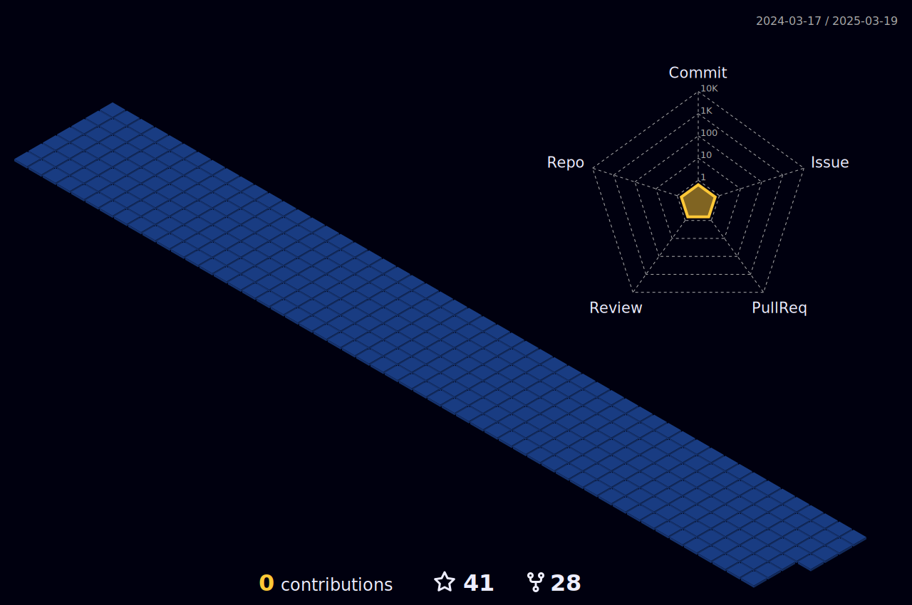

    

 
<!-- 

    

 -->

### Hello, there 

   
  
  Hi, I'm a Web3 Security Researcher, with 6 months experience in EVM and Solidity.

I'm very familiar with Solidity | DApp | Smart Contract | Staking | NFTs

I am currently learning Solidity, AMM, Yield Farming, Staking, Uniswap

 

 

  

<h2> Connect with me  </h2>

**Languages and Tools:**

<code></code>
<code></code>

💗 **My Favorites Techs:**

 

<!--  -->

   

